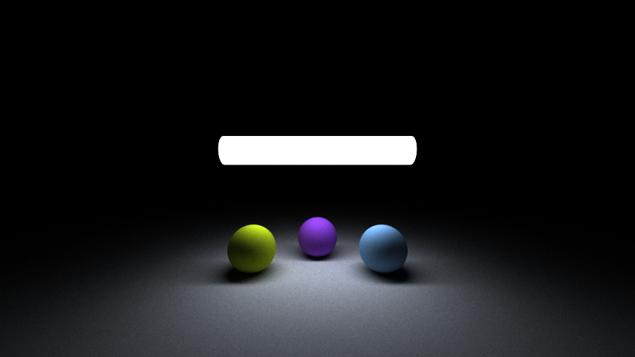
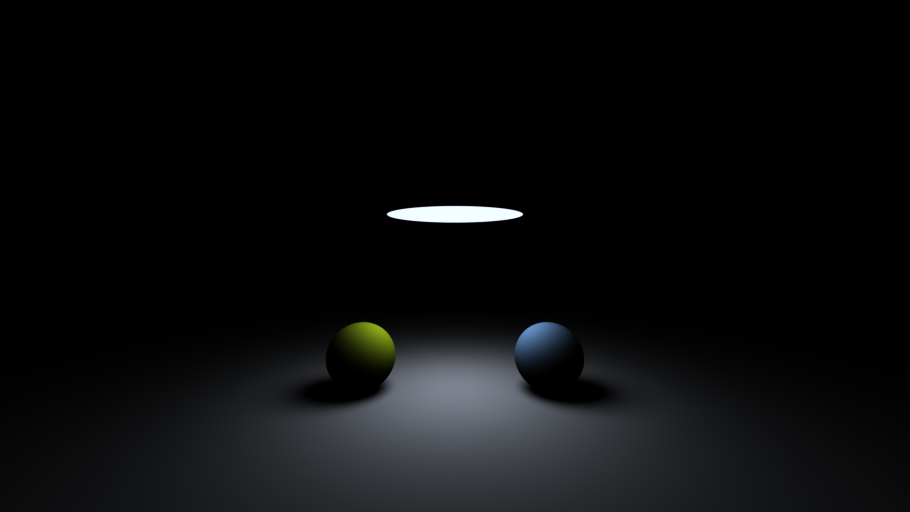
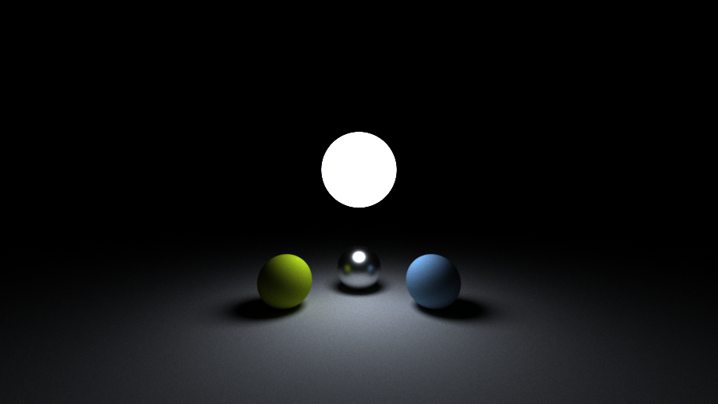
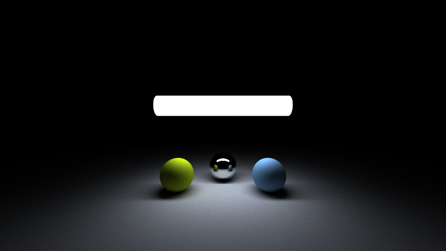
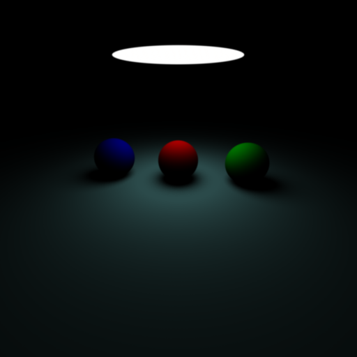
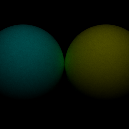
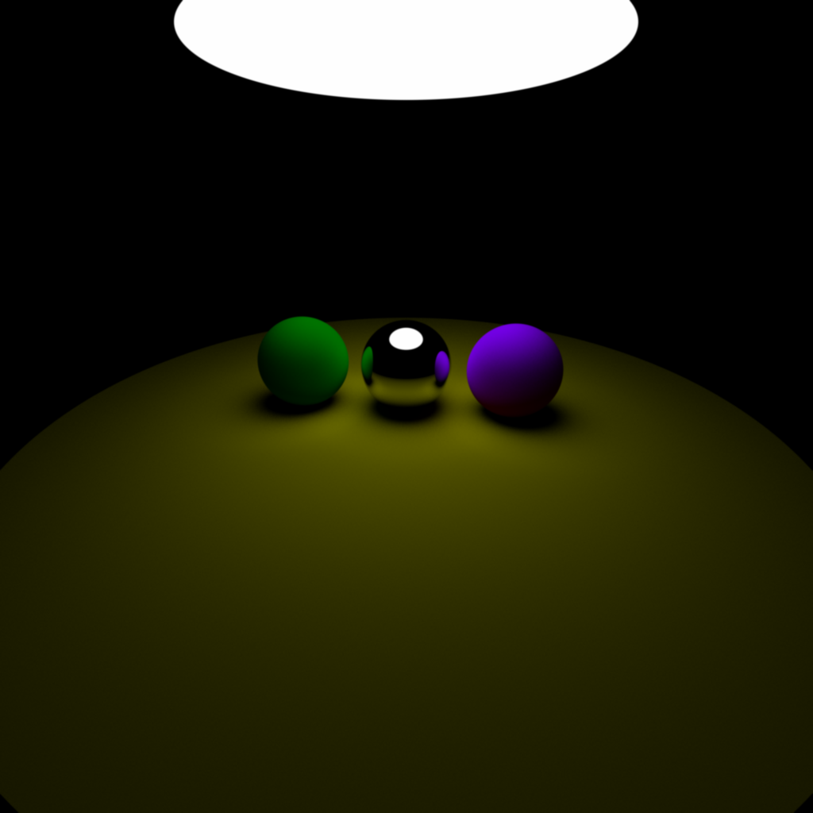

## proyecto para aprender rust

Se usa **integración estadística** mediante  [physically based render](https://www.pbr-book.org/3ed-2018/Light_Transport_III_Bidirectional_Methods/Bidirectional_Path_Tracing) basado en pbrt

path trace estándard y bidireccional

oclusión con pathtracer

integración de radianza a través de algoritmo de metropolis

bidirectional path tracing 

